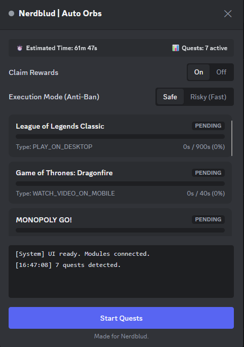

# Nerdblud Auto Orbs

A performance-optimized, modular automation tool for Discord Quests.

**Account Security Standards**: This script is built with account safety and stealth as a priority. All API payloads utilize humanized timing variations (jitter) and sequential event loops. API requests clear the minimum human-reaction threshold to prevent bot-detection flags and rate-limiting during automated quest farming.

---

## Installation Instructions

1. Install a userscript manager such as **Tampermonkey** or **Violentmonkey** (or run directly via the Discord Web Client `F12` Developer Console).
2. **[Click here](https://www.google.com/search?q=https://github.com/nerdblud/AutoOrbs/raw/master/auto-orbs.user.js)** to install the Nerdblud Auto Orbs script.

The script is configured to safely intercept Discord's Webpack chunk loading upon initialization, ensuring a secure binding to internal APIs without requiring the user to expose their authorization token.

---

## Project Architecture

This repository is organized into core modules to ensure maintainability and high performance:

* **`auto-orbs.user.js`**: The injection engine. It handles Webpack store interception, API routing, and manages the lifecycle of the quest progression logic.
* **`ui-framework.js`**: The core UI renderer. Contains inline CSS variables mapped directly to Discord's native palette (`--brand-experiment`, `--background-primary`) for seamless integration.
* **`api-interceptor.js`**: The network layer. Interacts securely with `QuestsStore`, `ChannelStore`, and Discord's internal `tn.get` / `Bo.get` wrappers.
* **`LICENSE`**: MIT License.
* **`README.md`**: Project documentation and technical specifications.

---

## Technical Specifications

### 1. Execution Mode Recalibration

To maintain account standing against Discord's anti-spam heuristics, execution modes have been calibrated for optimal safety. These delays are mathematically tuned to mimic human behavior while preserving farming efficiency.

| Execution Mode | Risk Level | Delay Strategy | Visual Indicator |
| --- | --- | --- | --- |
| **Sequential (Safe)** | Zero/Low | Random `2000ms-4000ms` jitter between requests | Green UI Badge |
| **Parallel (Fast)** | High | Synchronous execution of all active threads | Red UI Badge |
| **Video Quests** | Safe | Incrementing timestamps `+2.x` seconds per tick | Smooth Progress Bar |
| **Stream Quests** | Safe | Native heartbeat intervals (`~15s - 22s`) | ETA Timer |

### 2. Implementation Details

* **Zero-Token Tech**: Utilizes `webpackChunkdiscord_app` to bypass the need for manual token extraction. The script piggybacks on the client's authenticated session natively.
* **Humanized Jitter Sync**: Implements a randomized asynchronous delay (`Promise(setTimeout)`) to force-override linear bot behaviors, preventing predictive pattern flagging during quest submissions.
* **Native Cleanup**: Explicitly removes outdated UI frames and resets intervals upon re-injection to prevent memory leaks and overlapping DOM mutations.

---

## External Dependencies

The automation logic relies strictly on Discord's internal Webpack modules and requires zero external libraries:

1. **Discord Store API**: Extracted for problem/quest state management (`getQuest`, `getSFWDefaultChannel`).
2. **Native SVG Engine**: Integrated directly for UI icons (Clock, Star, Warning) without external font dependencies like FontAwesome.

---

## Contribution Guidelines

Pull Requests are welcome. To contribute:

1. Open an issue to discuss proposed UI changes or identify API regressions.
2. Ensure any new automation features maintain strict anti-ban randomized delays (minimum `1500ms` variance).
3. Target the `master` branch for all submissions.

---

## Inspired By

Engineered specifically for the **Nerdblud** community.

---

## License

MIT License © 2026. See the `LICENSE` file for details.
